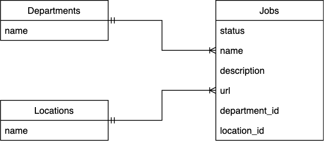

# OATS (Open Application Tracking System)

  

## Dependencies

- Ruby 2.5.1
- Rails 5.2.3

## Design

## To Be Updated

This README would normally document whatever steps are necessary to get the
application up and running.

Things you may want to cover:

* Ruby version

* System dependencies

* Configuration

* Database creation

* Database initialization

* How to run the test suite

* Services (job queues, cache servers, search engines, etc.)

* Deployment instructions

* ...
